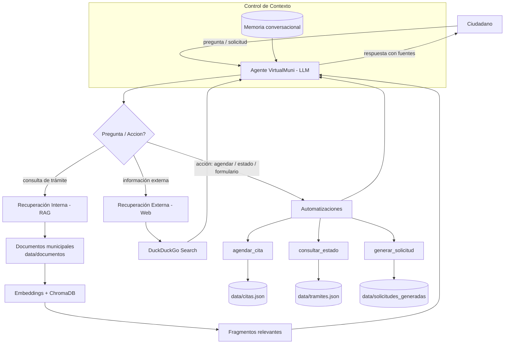

# Diagrama de Arquitectura - VirtualMuni (Municipalidad de Puente Alto)

Este diagrama puede renderizarse como diagrama Mermaid en GitHub, en
mermaid.live, o en editores como Typora/Obsidian.

## Diagrama Mermaid

## Descripción de flujo

1. **El ciudadano** envía una pregunta o solicitud al agente VirtualMuni (LLM).
2. **El agente (ReAct)** decide qué ruta seguir:
   - **Consulta de trámite** → recuperación interna RAG (documentos + embeddings + ChromaDB).
   - **Información externa** → búsqueda web vía DuckDuckGo.
   - **Acción** → ejecuta una herramienta de automatización.
3. **El LLM** combina la información recuperada con el **control de contexto**
   (memoria conversacional) y genera una respuesta trazable, citando la fuente.
4. **La respuesta** se entrega al ciudadano.
